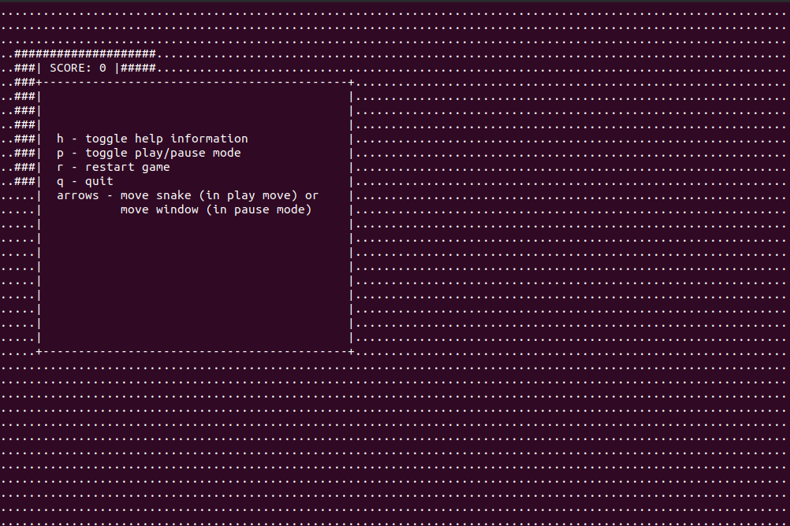
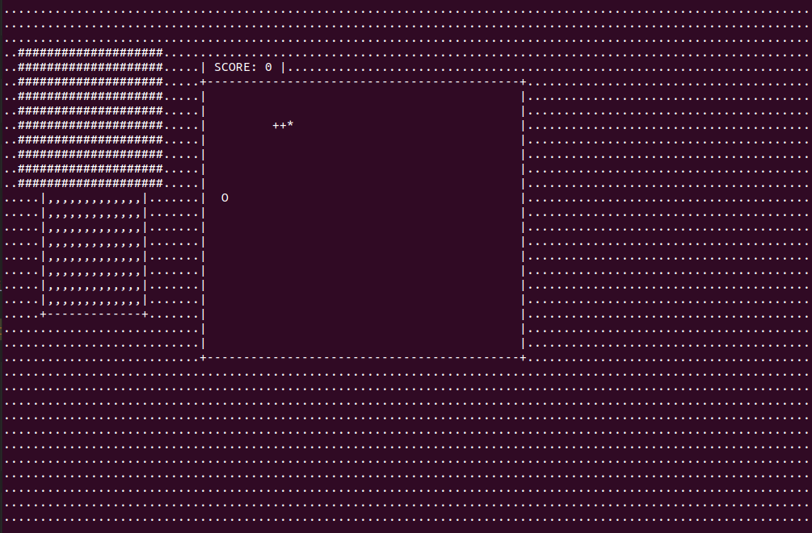
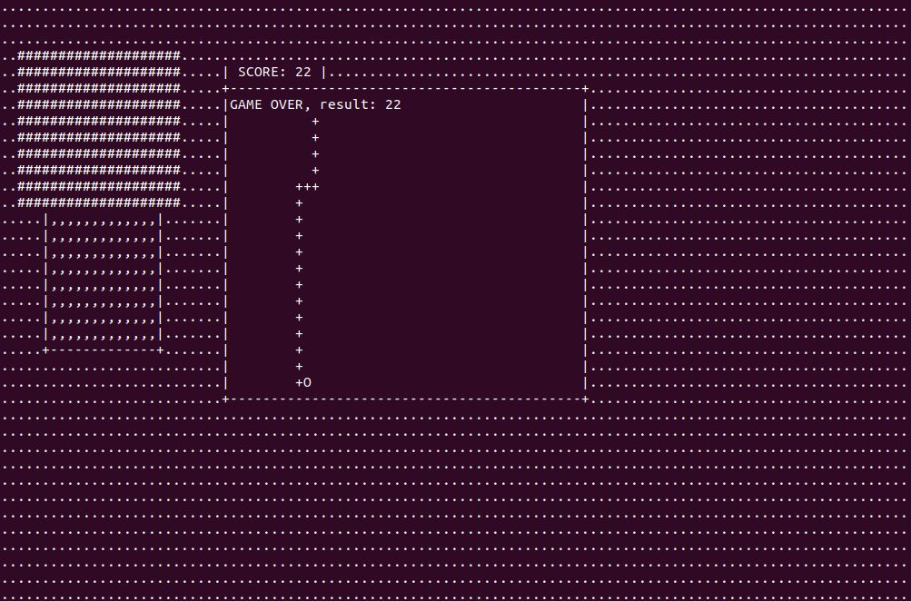

# Snake-ncurses
Snake game in Linux console using ncurses library
## Execute Commands for Linux
* `make clean` to clean up
* `make` to produce new version
* `./winsys` to run the game
## Game View

